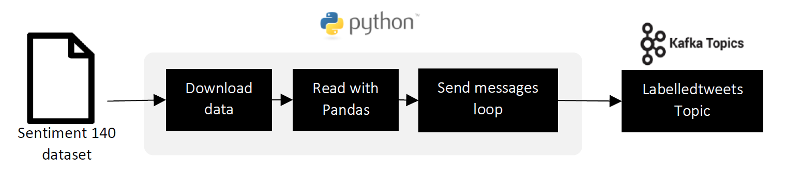
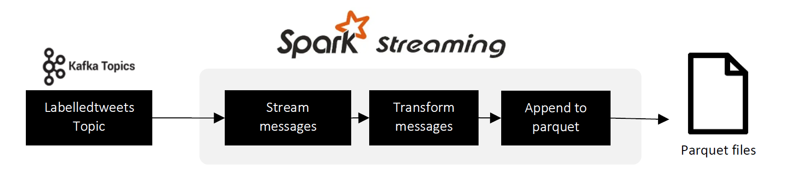
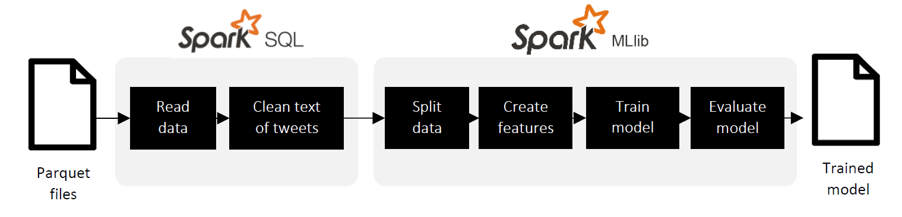
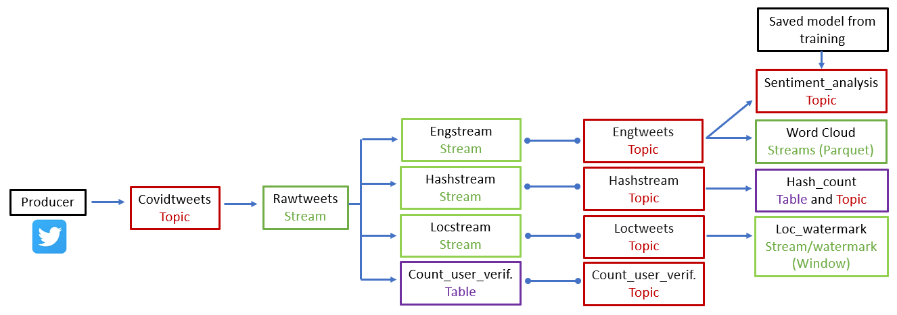

# Real-time-analytics-with-spark-streaming

# Introduction
This repo documents the steps taken from the collection of raw data to the creation of a streaming application on which real-time analysis of Covid-19 related tweets can be performed. 

It includes the methodology used to deploy and maintain a machine learning model to predict sentiment (positive or negative) of Covid-19-related tweets across the world in real-time.

The data is composed of tweets, pulled via the Twitter API, with a focus on Covid-19 related tweets and information about the users (location, verified or not, name, among others) as well as the tweet itself (how many retweets/replies, text, hashtag, among others).

Documentation on how to set up the API connection and environment and the difficulties encountered during this process is provided along with their solutions.

# Data description
This project relies on two datasets: the raw tweets pulled via the Twitter API and the Sentiment 140 dataset in a comma-separated values format.

## Twitter API
The information received via the API is about the tweet and contains details about the user who posted the tweet too.

A comprehensive list of variables and their data types and descriptions are available in Appendix 1: Raw Twitter Data Dictionary.

## [Sentiment 140 dataset](https://www.kaggle.com/kazanova/sentiment140)
The Sentiment 140 dataset has been created using 1.6M tweets that have been annotated as either negative or positive. The attributes of the datasets are exposed in Table 1. Only **"Target"** and **"text"** were used to train the model.

| Attribute | Description                                                         |
|-----------|---------------------------------------------------------------------|
| Target    | The polarity of the tweet (0 = negative, 2 = neutral, 4 = positive) |
| IDs       | Unique reference to identify tweet                                  |
| date      | Date of the tweet                                                   |
| user      | The user of the tweet                                               |
| text      | The text of the tweet                                               |

*Table 1: Sentiment 140 dataset*

# Setting up Confluent
In order to reproduce our results and be able to run the collection of tasks, the next steps need to be followed.

## Folder structure
The folder structure and its files are already provided in the zip file where this report is contained. Figure 1 shows the structure of the folder.

*Figure 1: Folder structure provided in the zip file.*

Table 2 describes some of the folders and files in the structure.

| Path                               | Description                                                                                                                                                                          |
|------------------------------------|--------------------------------------------------------------------------------------------------------------------------------------------------------------------------------------|
| 01 Sentiment Analysis Model.ipynb  | This notebook contains the script that trains the sentiment analysis model.                                                                                                          |
| 02 Connection Streams Tables.ipynb | This notebook contains the script that runs the KSQL statements located in the **ksql** folder.                                                                                          |
| 03 Country Window Stream.ipynb     | This notebook contains the script that creates a table with the number of tweets per country.                                                                                        |
| 04 Wordcloud Stream.ipynb          | This notebook contains the script that generates the Wordcloud stream from the Twitter data.                                                                                         |
| 05 Sentiment Analysis Stream.ipynb | This notebook contains the script that categorises the tweets according to their sentiment.                                                                                          |
| Configs folder                     | Folder where the configuration needed to connect with the Twitter API is stored.                                                                                                     |
| docker-compose.yml and Dockerfile  | Docker instructions needed to create the containers for data streaming.                                                                                                              |
| Ksql folder                        | Folder where the ksql statement are stored. Those statements are the ones that create streams and tables on Confluent and are used in the **02 Connection Streams Tables.ipynb** script. |
| Models folder                      | Folder where the model trained with the **01 Sentiment Analysis Model.ipynb** file is stored. It can also be found in a zip file in case the folder get corrupted.                       |
| Producer folder                    | Folder where the data producer used in the **01 Sentiment Analysis Model.ipynb** script is stored. This is the file that produces the labelled tweets data.                              |
| INSTRUCTION_README.md              | Summary of the instructions to run the repository code.                                                                                                                              |

## Installation
A Docker installation is needed to continue with this step. We used the following command in a terminal opened in the folder where the docker-compose.yaml file was located:

`sudo docker-compose up -d`

# Labelled tweets streaming
We used labelled tweets to train a machine learning model capable of identifying a negative or positive sentiment in the text. The process starts with a producer that sends each of the rows in the Sentiment 140 dataset as a message to a Kafka topic. Those messages are then processed to create the model features, which are used for training. We used Python, Kafka (via Confluent) and some components of Spark during the whole process, which is summarised in Figure 2. Please refer to the **01 Sentiment Analysis Model.ipynb** file to see the script.

*Figure 2: General diagram of the data stream for the training process.*

## Producer and Topic
In order to send the messages with the labelled tweets data, we created a Python script that acts as the producer, which is executed in the first part of the **01 Sentiment Analysis Model.ipynb** file. This script downloads the Sentiment 140 dataset from Google Drive and then reads the comma-separated value file with Pandas. Finally, the script sends each observation as a message to the **"labelledtweets"** topic on Confluent. This process can take up to 3 hours. Figure 3 shows a diagram with the activities of the producer.

*Figure 3: Diagram of the producer that sends the labelled tweets to Kafka.*

## Consumer and Data Sink
The next step in the streaming process uses Spark Streaming to read the topic and send it to an output sink. The messages in the topic are read from the earliest and then transformed to a Spark DataFrame format with two columns ("Target" and "Text"). Finally, each of the stream messages is appended to a parquet file. Figure 4 shows the diagram with the process to save the messages as a parquet file.

*Figure 4: Diagram of the consumer of the labelled data and the data sink.*

## Sentiment analysis model
Before training a machine learning model with the Parquet data, it was necessary to clean it using Spark SQL. The cleaning operations are exposed in Table 3. Then, the data was split into train and test set (70% and 30%, respectively).

| Name                                  | Description                                                                                                                                                  |
|---------------------------------------|--------------------------------------------------------------------------------------------------------------------------------------------------------------|
| Remove words that start with # or @   | Hashtags and mentions do not reflect the tweet sentiment, so we decided to remove them.                                                                      |
| Lower letter                          | We decided to transform every string to a lower letter for better matching.                                                                                  |
| Keep only English tweets              | We were only training a model for English tweets, so we removed other language tweets. This was achieved by categorising the language with the cld3 library. |
| Remove numbers and special characters | Numbers and special characters do not reflect the tweet sentiment, so we decided to remove them.                                                             |
| Keep tweets with at least one letter  | We can not predict the sentiment of a tweet with no words, so we decided to remove them.                                                                     |

*Table 3: Cleaning process of the tweets.*

The train set was used to create the data Pipeline on Spark MLib. In the data Pipeline, we tokenised the text, built the bigrams and calculated their frequency. It is worth mentioning that we used the most used 10,000 bigrams that appeared at least six times. Regarding the machine learning model, we decided to utilise Naïve Bayes because of its outstanding performance in classifying text and its speed compared to other models that use an expensive iterative process. Using Naïve Bayes in the data Pipeline we achieved an Area Under the Curve (AUC) of 0.57 on the test set.

Figure 5 shows the process performed to train a text classification model. The model was later saved on the **models** folder.

*Figure 5: Diagram of the data wrangling, training and evaluation of sentiment analysis.*

# Real-time tweets streaming
Figure 6 shows the general structure of the Project process. The sections below will explain each part in detail.

*Figure 6: Diagram with the general structure*

## Producer: API connector
[We used the Kafka Connect Source API to get access to the Twitter data](https://www.confluent.io/hub/jcustenborder/kafka-connect-twitter/). This connector produces messages that contain the information of the tweets detailed in the Data description section and can be configured. For our use case, we decided to filter those tweets that contain at least one of the following words: "Covid", "Covid-19", and "vaccine". The messages that the connector produce are stored in the "Covidtweets" topic.

Additional details of the configuration, like the API keys, can be found in the **twitterConnector.json** file inside the **configs** folder.

## Data Streams and Tables
KSQL was used to create streams and tables of different themes that we wanted to analyse. As we can see in Figure 6, the first stream was called "rawstream" and it was generated with the "covidtweets" topic created by the producer. As its name said, this stream has all the twitter variables mentioned in the data description (Twitter API) above and described in Appendix 1: Raw Twitter Data Dictionary. From this, three streams and one table were created.

The first one was the "engstream" stream. It contains 19 variables from "rawstream", and the tweets are filtered to include only English accounts (The variables are: CreatedAt, user_Id, user_name, ScreenName, user_location, follow_count, friend_count, user_creat_at, user_fav_count, user_verified, user_lang, text, Lang, geo_lat, geo_long, place_name, place_country, hashtag, and user_mention_name.). The result is saved in the topic "engtweets" in a JSON format. From this, a visualisation of the most common hashtags and a sentiment analysis are constructed.

Second, the "hashstream" stream and "hashtweets" topic were performed to analyse the hashtags of each tweet. In this task, only the tweet' Id and the text of the "Hashtags" are kept using the explode function in SQL. With this new topic, the hash_count table is created to count the number of different hashtags in a tumbling window of 10 minutes.

This window type was chosen because it is based on time intervals, and therefore, we could count the hashtags in an interval of 10 minutes without overlapping. Because of that, each record belongs to one window and thus, when one window ends, the next one starts. It is worth mentioning that it was not possible to use the "rawstream" or the "engstream" streams to create this table because changes in the "hashtag" variable format (explode function) affected the other columns and thus, the other tasks that used "rawstream" or "engstream" streams.

Then, tweet locations were investigated. The "locstream" stream was created with the same variables of "engstream", and also, a filter was added to only keep tweets with not null location (country). It produced a new topic with a JSON format from which the location_watermark_stream subscribes.

Finally, "count_user_verifed" table was created from "rawstream" stream to count the number of tweets of verified accounts in a tumbling window of 5 minutes. The variables resulted in this table were the "screenname" of the tweet owner and the count created.

Details in script **02 Connection Streams Tables.ipynb**.

## Word Cloud of tweets
A real-time word cloud for trending hashtags on Twitter is refreshed every 5 minutes. First, the data is read from the "EngTweets" topic. PySpark read data in a binary key-value format, with each row, has a timestamp attached to it.

For this task, the binary key-value pair is transformed into appropriate columns based on the schema defined in Table 4.

| Conversion | Affected Column                                                            |
|------------|----------------------------------------------------------------------------|
| To Long    | CREATEDAT, ID, USER_ID, USER_CREAT_AT                                      |
| To String  | USER_NAME, USER_LOCATION, USER_LANG, TEXT, LANG, PLACE_NAME, PLACE_COUNTRY |
| To Integer | FOLLOW_COUNT, FRIEND_COUNT, USER_FAV_COUNT                                 |
| To Boolean | USER_VERIFIED                                                              |
| To Double  | GEO_LAT, GEO_LONG                                                          |
| To Array   | HASHTAG, USER_MENTION_NAME                                                 |

*Table 4: Schema used to read the engtweets topic*

### Data Transformation and Aggregation
After read the tweets with the schema, only the hashtag variable is kept. Since this column is an array, the hashtag text is obtained using the explode function of SparkSQL.

Then, these tweets are grouped using a window-based aggregation of 60-minute to count words that update it every 5 minutes. By using the window function, it will only count the words which are received between the 60-minute window.

Also, to consider the data which arrive late in the application, we have used watermarking. Here, watermarking will preserve the intermediate state of partial aggregation for 60 minutes. For instance, the data which is generated at 12:04 is received at 12:11 in the application. The application will use 12:04 instead of 12:11 to update the older counts for the 12:00 and 13:00 window.

### Visualise Trending HashTags
The continuous stream of data is read into the memory buffer and assessed as a table using the Spark SQL. The final query result is converted into the Pandas data frame. This data frame is printed as a word cloud after performing grouping and sorting. The resulting word cloud (Figure 7) is updated every 5 minutes, showing the trending hashtags on Twitter.

As expected, because of the initial filters "Covid", "Covid-19" and "vaccine" mentioned above, most people are talking about Covid-19 and the vaccination process. In this context, other themes are the situation in Myanmar, mental health, vaccine brands, lockdown and pandemic.

*Figure 7: Word Cloud*

See script **04 Wordcloud Stream** for details.

## Count of Tweets by Location
Using "loctweets" as the topic, this window stream allows getting a count of Covid-19 related tweets by location (country level) over a period of 2 minutes. There is a watermark to drop old data. It has a duration of 1 minute for late data to be allowed to come in up to that time.

Looking at the example below, we can see that India currently has the highest count of tweets about Covid-19, representing the current situation and outbreaks the country is experiencing.